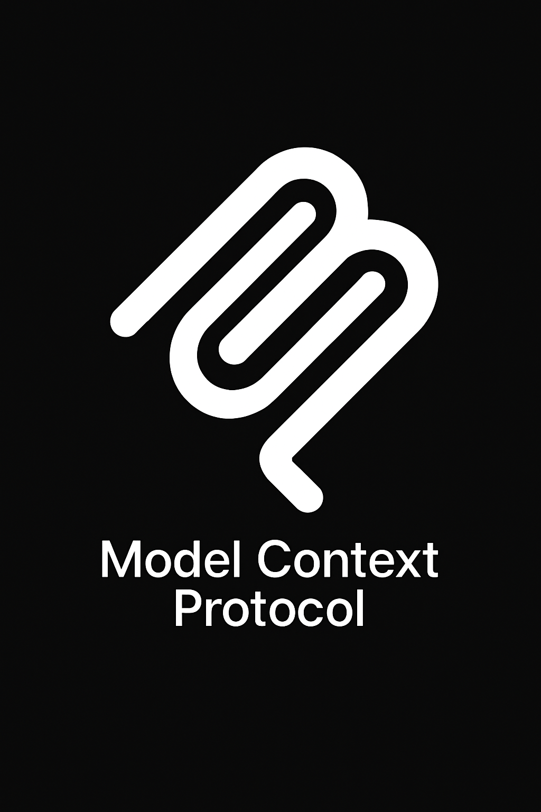
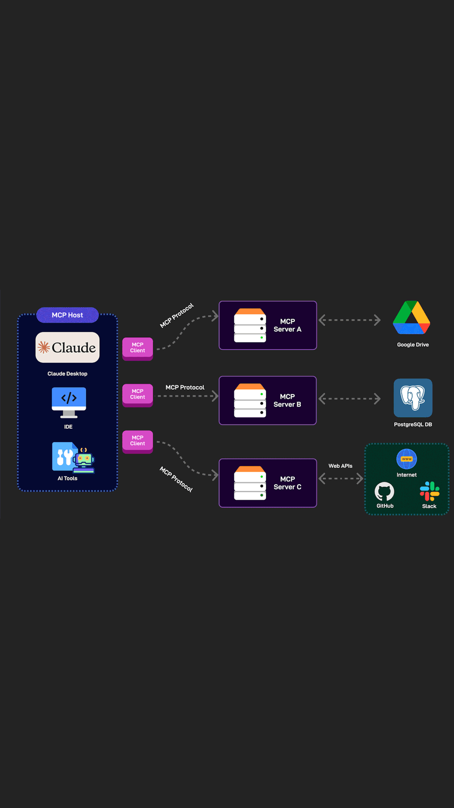
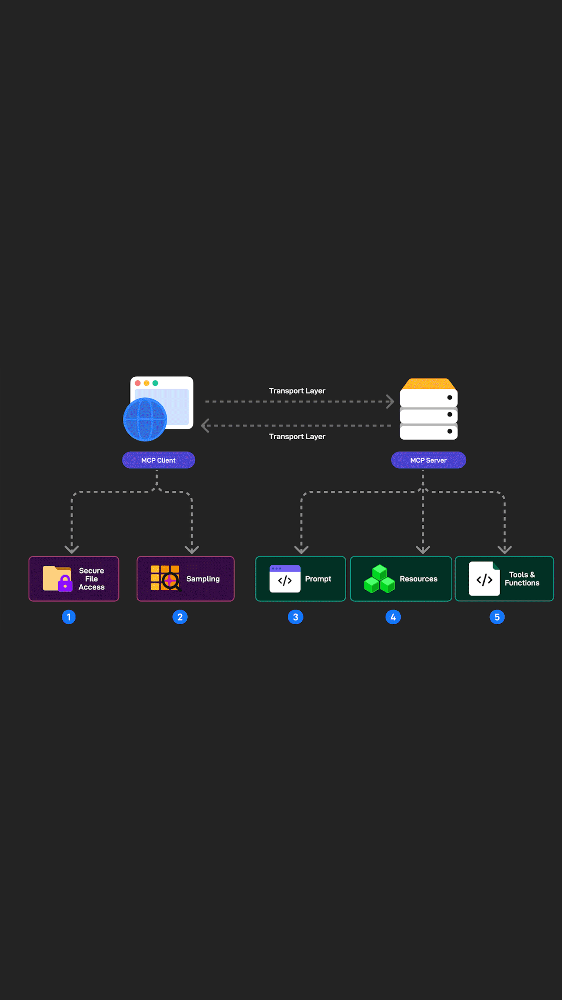

# MCP 簡介
<!-- _header: 'MCP Introduction' -->

Model Context Protocol ( MCP )，中文譯為模型上下文協議。
規範應用程式如何回覆 LLM 經過標準化的上下文，讓 LLM 在處理相關內容時，能夠更加精準與減少幻覺，在此同時也提供 LLM 應用上更多的可能性。


---


# MCP 優劣勢
<!-- _header: 'MCP Pros / Cons' -->

<style scoped>
    h2 {
        font-size: 1em;
    }
    li {
        font-size: 20px;
    }
</style>

## 優勢 (Pros)
- **標準化協議**: 提供統一的介面規範，降低整合複雜度
- **減少幻覺**: 透過結構化上下文提供，提升 LLM 回應準確性
- **模組化設計**: 可獨立開發和部署不同功能的 MCP Server
- **擴展性強**: 支援多種資源類型和工具整合
- **生態系統**: 與主流 AI 應用程式良好整合

## 劣勢 (Cons)
- **學習成本**: 需要理解協議規範和實作細節
- **開發複雜度**: 相較於直接整合，需要額外的協議層
- **效能考量**: 多層通訊可能帶來延遲
- **相依性管理**: 需要維護 MCP Server 的穩定性和版本相容性
- **除錯困難**: 分散式架構增加問題排查複雜度
- **安全性問題**: 需要確保 MCP Server 的安全性和權限控制


---



# MCP 基礎架構
<!-- _header: 'MCP General Architecture' -->

- **MCP Host**: 處理客戶端與伺服器之間的通訊，像是 Claude Desktop / Cursor / Raycast
- **MCP Client**: 發起請求的應用程式或服務，通常是需要獲取上下文資訊的 LLM 應用，大多數時候，MCP Host 與 MCP Client 由同一個角色承擔責任。
- **MCP Server**: 提供特定領域知識或功能的服務端，回應客戶端的請求並提供標準化的上下文資料


<!-- _footer: '圖片來源： [ByteByteGo](https://blog.bytebytego.com/p/ep154-what-is-mcp)' -->
---

# MCP Server 上下文來源
<!-- _header: 'MCP Server Context Sources' -->



- **Prompts**: 預先撰寫固定的提示詞，當 LLM Agent 需要時能夠可攜帶參數的調用預先定義好的提示詞使用。
- **Resources**: 預先設置好的靜/動態資源，以供 LLM Agent 需要時可以獲取對應資源內容，資源格式可以是單純文本或是 binary
- **Tools/Functions**：以標準函式描述方式 function schema 提供的互動操作，允許 LLM Agent 觸發特定行為，ex. 寫入資料、整合第三方應用。

<!-- _footer: '圖片來源： [ByteByteGo](https://blog.bytebytego.com/p/ep154-what-is-mcp)' -->

---

# 如何配置 Prompts
<!-- _header: 'How to setting Prompts' -->

<style scoped>
    pre {
        font-size: 20px;
    }
</style>

```typescript
const PROMPTS = {
  "git-commit": {
    name: "git-commit",
    description: "Generate a Git commit message",
    arguments: [
      {
        name: "changes",
        description: "Git diff or description of changes",
        required: true
      }
    ]
  },
}
server.setRequestHandler(ListPromptsRequestSchema, async () => {
  return {
    prompts: Object.values(PROMPTS)
  };
});
```

<!-- _footer: 'More on the next slide' -->

---

 <!-- _header: 'How to setting Prompts' -->
 <!-- _paginate: hold -->

<style scoped>
    pre {
        font-size: 20px;
    }
</style>

```typescript
server.setRequestHandler(GetPromptRequestSchema, async (request) => {
  const prompt = PROMPTS[request.params.name];
  if (!prompt) {
    throw new Error(`Prompt not found: ${request.params.name}`);
  }

  if (request.params.name === "git-commit") {
    return {
      messages: [
        {
          role: "user",
          content: {
            type: "text",
            text: `Generate a concise but descriptive commit message for these changes:\n` +
                  `${request.params.arguments?.changes}`
          }
        }
      ]
    };
  }

  throw new Error("Prompt implementation not found");
});
```

---

# 如何配置 Resources / Toos
<!-- _header: 'How to setting Resrouces / Tools' -->


Google Drive MCP Server 範例參考 : [Google Drive MCP Server](https://github.com/modelcontextprotocol/servers/blob/main/src/gdrive/index.ts)

---

# 當紅炸子 MCP Servers
 <!-- _header: 'Popular MCP Servers' -->


[Awesome MCP Servers](https://github.com/wong2/awesome-mcp-servers)

用過都說讚 :

[Brave MCP Server](https://github.com/modelcontextprotocol/servers/blob/main/src/brave-search/README.md) / [Brave API](https://api-dashboard.search.brave.com/)
[Playwright MCP Server](https://github.com/microsoft/playwright-mcp)
[FileSystem MCP Server](https://github.com/modelcontextprotocol/servers/tree/main/src/filesystem)

族繁不及備載

---

# 生態系
<!-- _header: 'Ecosystem for MCP' -->


[Official Clients List](https://modelcontextprotocol.io/clients)
[Awesome MCP Clients](https://github.com/punkpeye/awesome-mcp-clients)

| 類型       | 名稱     | 連結                                     |
| ---------- | -------- | ---------------------------------------- |
| Editor     | VSCode   | [VSCode](https://code.visualstudio.com/) |
| Editor     | Cursor   | [Cursor](https://www.cursor.com/)        |
| Editor     | Windsurf | [Windsurf](https://windsurf.com/editor)  |
| Extensions | Cline    | [Cline](https://github.com/cline/cline)  |

<!-- _footer: 'More on the next slide' -->

---

<!-- _paginate: hold -->


| 類型             | 名稱           | 連結                                                       |
| ---------------- | -------------- | ---------------------------------------------------------- |
| LLM Agent        | Claude Desktop | [Claude Desktop](https://claude.ai/download)               |
| LLM Agent        | Chatwise       | [Chatwise](https://chatwise.app/)                          |
| LLM Agent        | Cherry Studio  | [Cherry Studio](https://github.com/CherryHQ/cherry-studio) |
| Command Launcher | RayCast        | [RayCast](https://www.raycast.com/)                        |

---


# 謝謝聆聽
<!-- _header: 'Thanks for your listening' -->

<style scoped>
    h1 {
        font-size: 2em;
        color: #2c3e50;
        text-align: center;
        margin-bottom: 0.8em;
    }
    .contact-info {
        font-size: 0.9em;
        text-align: center;
        margin-top: 1.5em;
        color: #34495e;
    }
    .resources {
        font-size: 0.8em;
        margin-top: 1.5em;
        color: #7f8c8d;
    }
    .highlight {
        color: #27ae60;
        font-weight: bold;
        font-size: 0.9em;
    }
</style>

<div class="resources">

**延伸資源**

• [MCP 官方文件](https://modelcontextprotocol.io/)
• [Awesome MCP Servers](https://github.com/wong2/awesome-mcp-servers)
• [Awesome MCP Clients](https://github.com/punkpeye/awesome-mcp-clients)

</div>